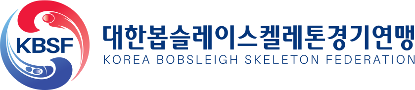
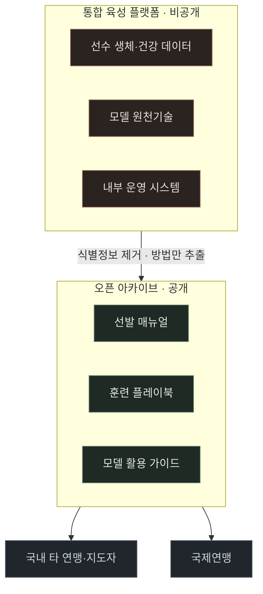
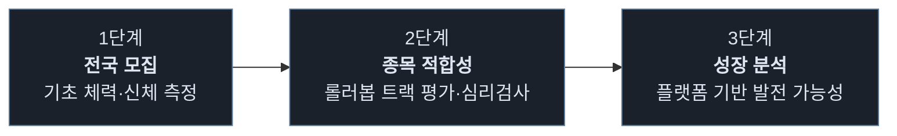

  

 

---

## 소개

대한봅슬레이스켈레톤경기연맹(KBSF)의 통합 육성 플랫폼에서 외부 공유가 가능한 자료를 모아 공개하는 저장소입니다.
선수 선발·훈련에 쓰는 매뉴얼과 가이드를, 다른 연맹·지도자가 참고할 수 있도록 정리했습니다.

## 공개 범위

공유 가능한 자료만 공개하며, 선수 개인정보와 모델 원천기술·생데이터는 포함하지 않습니다.

| 공개 | 비공개 |
| --- | --- |
| 선수 선발·발굴 매뉴얼 | 모델 원천 소스코드 |
| 종목별 훈련 플레이북·적용 사례 | 선수 생체·건강 원천 데이터 |
| 기록 예측모델 활용 가이드 (입력값·해석) | 개인정보 및 미성년 선수 데이터 |
| 측정 지표·표준 프로토콜 | 내부 운영 시스템 |

## 문서

| 문서 | 내용 |
| --- | --- |
| [선수 선발 매뉴얼](docs/01_선발매뉴얼.md) | 인재 발굴 3단계 절차, 측정 변수 20종, 심리검사(SSS-V·Grit·CSAI-2), 영국 Bath 대학 모델을 한국 여건에 맞춰 재구성 |
| [훈련 플레이북](docs/02_훈련플레이북.md) | 데이터 기반 훈련 설계·유망주 육성 사례 *(정리 중)* |
| [기록 예측모델 활용 가이드](docs/03_예측모델_활용예시.md) | 피니시 타임·기록 예측모델을 타 연맹이 적용하는 법 *(정리 중)* |

## 선수 선발 과정

선발은 세 단계로 진행합니다. 전국 모집·기초 측정에서 시작해, 종목 적합성과 심리적 자질을 확인하고, 플랫폼에 쌓인 과거 선수 데이터에 비추어 발전 가능성을 봅니다.

측정은 5개 영역, 20개 지표로 구성됩니다.

| 영역 | 지표 수 | 내용 |
| --- | :---: | --- |
| 신체 조성 | 6 | 체성분·근육량·체지방 |
| 운동 수행력 | 6 | 스프린트·점프·푸시력 |
| 심리 특성 | 3 | 위험 감수(SSS-V)·끈기(Grit)·경쟁 불안(CSAI-2) |
| 종목 특화 | 2 | 트랙 적응·스타트 |
| 기본 정보 | 3 | 인적 사항 |

## 통합 플랫폼

실제 선수 데이터를 다루는 운영 환경은 비공개입니다. 아래 데모는 개인정보를 제외한 공개 화면입니다.

**검증된 기능**
- 경기 기록·구간기록 분석
- 머신러닝 기반 피니시 타임 예측 (XGBoost)

**개발 중 (로드맵)**
- 스마트워치 기반 컨디션·훈련부하 모니터링
- 스포츠과학 문헌 기반 코칭 가이드

데모 · <https://demo-static-production.up.railway.app/>

## 문의

자료 활용·협업 문의는 아래로 연락 주세요.

- 자료 담당 · junhyeonkim92@gmail.com
- 연맹 대표 · bob@sports.or.kr

 

**(사)대한봅슬레이스켈레톤경기연맹**　·　KOREA BOBSLEIGH SKELETON FEDERATION

회장 전찬민　·　사업자등록번호 101-82-30725 
서울특별시 송파구 올림픽로 424 우리금융아트홀 4층 401호 
Tel 02-420-1120　·　Fax 02-420-1246　·　http://www.kbsf.co.kr　·　bob@sports.or.kr 
© 2013 (사)대한봅슬레이스켈레톤경기연맹. All rights reserved.　·　공개 자료 CC BY-NC 4.0 (저작자표시–비영리)

